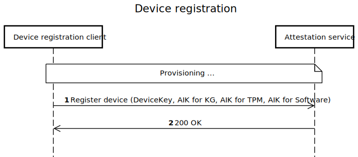
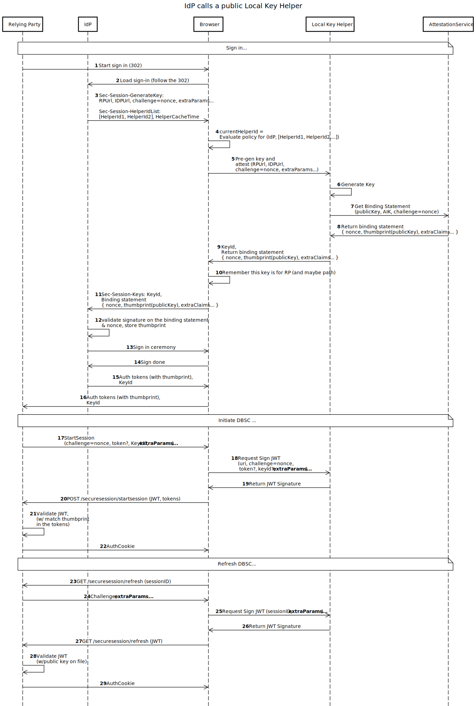

# Device Bound Session Credentials for Enterprise - explainer

This is the repository for Device Bound Session Credentials for Enterprise. You're welcome to
[contribute](CONTRIBUTING.md)!

## Authors

- [Sameera Gajjarapu](sameera.gajjarapu@microsoft.com), Microsoft
- [Alexander Tokerev](alextok@microsoft.com), Microsoft

## Contributors

- [Olga Dalton](), Microsoft
- [Kristian Monsen](), Google
- [Phil Leblanc](), Google
- [Sebastian](), Google
- [Arnar Birgisson](), Google
- [Pamela Dingle](), Microsoft
- [Paul Garner](), Microsoft
- [Erik Anderson](), Microsoft
- [Will Bartlett](), Microsoft
- [Kai Song](), Microsoft
- [Amit Gusain](), Microsoft

## Participate (to come)

- [Issue tracker]()
- [Discussion forum]

## Overview

Device Bound Session Credentials for Enterprise - DBSC(E), is not a separate proposal but an addition to existing [DBSC](https://github.com/wicg/dbsc) proposal to enhance the key generation mechanism and security for enterprise use cases. It aims to provide a mechanism for enterprise and advanced browser customers to be able to deploy true device binding for any browser session, hence protecting against session hijacking and credential theft.

## Why DBSC(E)?

While the original DBSC proposal is focused on providing a mechanism for browsers to bind session credentials to a device, it still remains vulnerable to malware that can run on a device during the web application signin/login. If a malware happens to be already running in the device, it can force the user to login, and provide its own credentials (asymmetric key pair) to the web application, there by stealing the session. Any upcoming sessions after this, even with DBSC, will not be reliable.

DBSC(E) aims to mitigate this risk by introducing the concept of credential generation (asymmetric device-bound key) during the device registration and binds all the future sessions to the device. It guaratees any given session to be bound to the device, if the device registration is performed when there is no malware on the device (a state referred to as "clean room"). With DBSC(E), the malware will not be able to compromise a device even during signin/login. Device registration is also expected to be a once-in-a-lifetime operation, and hence the user will not be required to perform this operation again, reducing the chances of malware compromising the device.

## How does it integrate with DBSC?

DBSC(E) is not intended to be a separate proposal from DBSC, it is rather building on existing DBSC, and adds the binding specific details to the protocol. It is expected that the DBSC(E) proposal will be integrated into the DBSC proposal in the specification. In the high-level design, we have folded the DBSC proposal into the end to end flow, for and end-to-end illustration of cookie binding. Please read the [DBSC proposal](https://githuub.com/wicg/dbsc) before you proceed.

## Terminology

### **Browser**:

In this document, "Browser" refers to a functionality in a web browser that is responsible for the DBSC protocol. This functionality will be implemented by Edge, Chrome (or their common engine), and other browsers that choose to implement DBSC/DBSC(E).

### **Relying Party (RP)**:

A web application that uses DBSC(E) protocol for cookie binding.

### **Identity Provider (IdP)**:

IdP is an authentication server that can be either external to the Relying Party or part of the Relying Party. Eg: Office.com authenticating with Microsoft or google.com authenticating with google. Note: The protocol doesn't change if the IdP is part of the Relying Party, except that some redirects between the IdP and the RP can be skipped or implemented by other means.

### **Device Registration Client**:

A process where the user registers the device with the IdP. This process is expected to be a once-in-a-lifetime operation.

The device registration is a process that establishes a trust between the device and a service that maintains a directory of all devices. This document does not cover the protocol of device registration, but it assumes that during device registration, some asymmetric keys are shared between the client and the service, typically a device key and some other keys necessary for the secure device communication.

A client software component that performs the device registration is called a _device registration client_. As mentioned above, the key assumption in DBSC(E) is that device registration happened in a clean room environment, and it is the responsibility of the device owner to ensure this.

One device registration client can manage multiple devices on the same physical device. There also can be multiple device registration clients on the same device. The device registration client can be owned and supported by:

- Operating system - the device gets registered when the OS is installed.
- Browser - the device gets registered when the browser is installed.
- Device management software (MDM provider) - the device gets registered when the MDM is enrolled.
- Third-party software vendor - the device gets registered according to the vendor rules.

DBSC(E) aims to support most of these scenarios. It does not define the device registration protocol amd is only concerned with the keys generated in a "clean room" state and the management of the generated keys to prove device binding.

### **Local Key Helper**:

**Local Key Helper** is an integral part of the the **Device Registration Client** , a software interface responsible for the DBSC Key management. It can be Public or Private and is expected to be either shipped as a part of a given enterprise framework (with the IdP/OS) or can be installed by a provider in compliance with the protocol expanded below.

From the deployment point of view there are two types of local key helpers: _well-known_(_private_) and _third party_(_public_)

- _Public local key helper_ or _third party_: Can be accessed by any Identity Provider (IdP). Typically owned by a provider different from the IdP, communicates with the IdP through a well-defined public protocol. A third party local key helper has a special deployment mechanism.
- _Private local key helper_ or _well known_ : Can be specific to an IdP. Typically owned by the IdP and will have a private protocol to communicate with the IdP. Comes with either OS or built into the browser. It assumed that well-known key helpers are **trusted and enabled by default** in a browser. A browser knows how to activate a well-known key helper.

The Local Key Helper is responsible for:

- Generation of the binding key and producing binding statements (see below)
- Producing signatures with the binding key
- Cleanup of the binding key and its artifacts (when the user clears the browser session or the key is unused for a long time).

#### Platform Examples:

Please refer to the Windows Local Key Helper [here](./KeyGeneration.md#local-key-helper-on-windows) for an example of a Local Key Helper.

Note: We plan to provide a reference implementation of the Local Key Helper for major platforms here in the future.

### **Attestation Service**:

A service that is responsible for verifying the device registration and providing the attestation to the IdP. The attestation service can be owned by the IdP or a third party. DBSC relies on the attestation service to validate the binding statement and ensure that the binding key and the device key belong to the same device. We have added details on the specifics of the binding artifacts generated during the device registration process, and the validation of the binding statement in the [DBSC(E) Key Generation](#key-generation-specifics) section.

## High-Level Design

DBSC(E), if enabled for a given enteprise, specifies the generation of the cryptographic artifacts (keys and binding info) before a sign in session is established. By enabling the browser to invoke specific APIs based on an existing policy, it allows enterprises to add to the existing key generation. It also allows them to place stricter restrictions on specific sessions, hence providing the flexibility to secure a session appropriately.

The high-level design is divided into two parts:

1. Key generation and validation before the session starts (DBSC(E) is focused on this part).
2. DBSC protocol applied with the generated keys (DBSC is focused on this part).

Since we want to integrate DBSC(E) with the original design and make it as widely applicable as possible for all enterprise users, we are adding high-level design for the most possible combinations in this document. The intent is to have a specification that can be implemented by any browser vendor, and can be used by any IdP, and any Local Key Helper. We differentiate between private and public local key helpers, since there are implications to the protocol based on the type of local key helper. For example, we expect well establised IdPs like Microsoft, Okta, Github to ship their own local key helper as a part of the IdP. We also optimize the protocol for RP and IdP as the same service (google client authenticated by google service as an example), since it simplifies the protocol and align with the perf goals for specific services.

### Device Registration (Pre-Session)

Any enterprise user is expected to either use a device issued by their organization or register their personal device with the organization. The device registration is expected to be a once-in-a-lifetime operation, and the user is expected to perform this operation in a clean room environment.

### DBSC(E) Highlevel design

As mentioned above, since an enterprise can choose to have its own Authentication service (IdP) determine the key generation, or have a third party generate the keys, we will cover both the use cases below.

#### IDP Calls Public Local Key Helper

Note: To map this design with the existing DBSC

- Steps 1-16 specify the key generation process for a public local key helper
- Steps 17-29 are [DBSC](https://github.com/wicg/dbsc), added for completeness.

Highlights:

1. **Session initiation with special headers (steps 1-4):** When a user starts a sign-in process, or initiates a session, the IdP will call the browser to generate a key for the session. It is expected that the webpage initiating the session sends special headers `Sec-Session-GenerateKey` and `Sec-Session-HelperIdList` to the browser, to indicate that the session is expected to be DBSC(E) compliant.

   - The `Sec-Session-GenerateKey` header contains the URL of the webpage(RP), the URL of the IdP (authentication service in most cases), a `nonce`, and any extra parameters that the IdP wants to send to the Local Key Helper.
   - As the Local Key Helper is public or thirdparty, and potentially can be from a different vendor, `nonce` is essential to prevent the clock skew difference between the IdP and the Local Key Helper. The `nonce` is expected to be a random number generated by the IdP.
   - The `Sec-Session-HelperIdList` header contains a list of helper IDs that the browser can use to generate the key. As we touched upon before, there could be multiple devices on a single physical device, and/or multiple device registration clients on a single device. The `HelperId` helps the browser to choose the right **Local Key Helper** to generate the key. The browser will evaluate the policy for the IdP and the helper IDs, and choose the appropriate helper ID to generate the key. The browser will then call the Local Key Helper to generate the key.

1. **Key and Binding Statement Generation (steps 5-9):** The Local Key Helper generates the key and the binding statement. AIK refers to the `Attestation Key` described [above](#attestation-key). The binding statement is expected to contain the `nonce` sent by the IdP, the thumbprint of the public key, and any extra claims that the IdP wants to send.

   - Format of the Binding Statement: We expect the `binding statement` will be a `string`, as we want to keep the format open to allow for platform-specific optimizations. However, the validation of the `binding statement` is prescribed to include `nonce` and the thumbprint of the public key. The `binding statement` is expected to be shortlived to prevent forgery of the binding statement from a different device. More details on `binding statement` can be found [here](./KeyGeneration.md#binding-statement).
   - The `extra claims` is a provision added for specific IdPs or Local Key Helper vendors to add any additional information to the `binding statement`. It is intentionally left undefined, and can be customized.
   - TBD define under which conditions: Local Key Helper can optionally signal the browser to cache the Binding Statement in the browser. This is to avoid repeated calls to the Local Key Helper for the same IdP. The browser can cache the Binding Statement for a certain time, and if the IdP requests a new key within that time, the browser can return the cached Binding Statement.

1. **Sign In/Session Initiation (steps 10-14)**: The `Binding Statement`, with the `KeyId` is expected to be returned to the IdP witha new header, `Sec-Session-Keys`. The IdP will [validate](#binding-statement---generation-and-validation) the signature on the `Binding Statement`, `nonce` and stores the thumbprint of the public key. Once the validation succeeds, the IdP will proceed with the sign-in ceremony and generate the auth tokens, that embed the thumbprint of the public key. The `KeyId` is expected to be returned to the Relying Party, and the IdP will use the `KeyId` to identify the key to be used for the session.

1. **SignIn Succeeds with binding (steps 15-16)**: The IdP will return the auth tokens to the RP,with the thumbprint of the public key embedded in the token.

1. **DBSC Protocol (steps 17-29)**: The DBSC protocol is applied with the generated keys. RP can now initiate a session with the acquired tokens and the browser generates a JWT with the Local Key Helper which embeds the binding info. The signed JWT is now returned along with the tokens to the RP, which is inturn embedded in any cookies generated and stored by the RT, binding them. All future transactions including a refresh session now will look for the binding info in the cookies, hence securing them against session hijacking.
