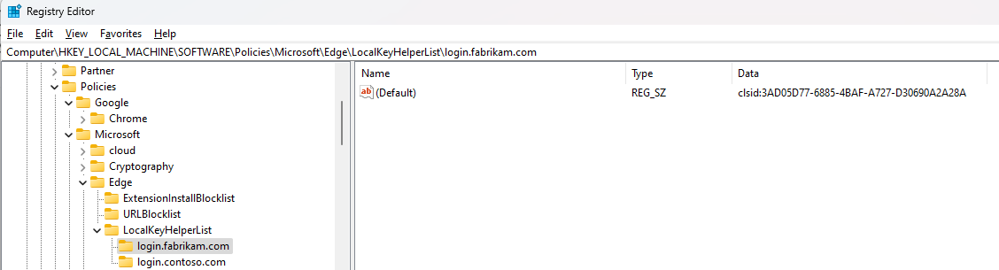

### Local key helper on Windows

On Windows, a Local key helper is a COM class. A COM interface that the local key helper implements is TBD (working name for this document is ILocalKeyHelper)

#### Deployment of a 3rd party local key helper.

Local key helpers will be deployed using registry.

The base registry key is:

```
[HKEY_LOCAL_MACHINE\SOFTWARE\Policies\<Company>\<Browser>\LocalKeyHelperList]
```

i.e.

```
[HKEY_LOCAL_MACHINE\SOFTWARE\Policies\Microsoft\Edge\LocalKeyHelperList]

[HKEY_LOCAL_MACHINE\SOFTWARE\Policies\Google\Chrome\LocalKeyHelperList]
```

Every local key helper has a child key in the above registry key. The entry for the local key is a registry key with the name equals to the local key helper id, the default value stores activation ID, prefixed by an activation scheme.

```
[HKEY_LOCAL_MACHINE\SOFTWARE\Policies\<Company>\<Browser>\LocalKeyHelperList\<LocalKeyHelperId>]
@="<Scheme>:<API activation ID>"
```

Here is example:

```
[HKEY_LOCAL_MACHINE\SOFTWARE\Policies\Microsoft\Edge\LocalKeyHelperList\login.contoso.com]
@="progid:App.Component.1.0"

[HKEY_LOCAL_MACHINE\SOFTWARE\Policies\Microsoft\Edge\LocalKeyHelperList\login.fabrikam.com]
@="clsid:3AD05D77-6885-4BAF-A727-D30690A2A28A"
```

Currently the supported schemes are:

1. clsid: \<GUID\> - CLSID of a COM class that implements the Local Key Helper.
2. progid:\<ProgId string\> - [a programic identifier](https://learn.microsoft.com/en-us/windows/win32/com/-progid--key) of the local key helper.

This scheme can be extended by other schemes in future.
The local key helper registry key can have extra values, which we can use for in future.

Here is a visual example how Local key helper is organized:



When the browser needs to communicate with a local key helper. It uses its ID to locate the registry key, then reads the default value of this registry key and activates the object by the activation scheme (CLSID or ProgId according to the document). After activation it queries ILocalKeyHelper interface and invokes corresponding methods.

#### Well-known local key helpers on Windows

A well-known local key helper list on Windows is a list of helperId to clsid, that either harcoded or predefined in the browser settings.

