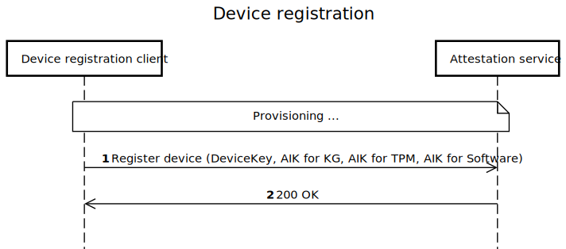

<!-- START doctoc generated TOC please keep comment here to allow auto update -->
<!-- DON'T EDIT THIS SECTION, INSTEAD RE-RUN doctoc TO UPDATE -->

- [Device Bound Session Credentials for Enterprise - explainer](#device-bound-session-credentials-for-enterprise---explainer)
  - [Authors](#authors)
  - [Contributors](#contributors)
  - [Participate (TBD links)](#participate-tbd-links)
  - [Overview](#overview)
  - [Why DBSC(E)?](#why-dbsce)
  - [How does it integrate with DBSC?](#how-does-it-integrate-with-dbsc)
  - [Terminology](#terminology)
    - [Browser](#browser)
    - [Relying Party (RP)](#relying-party-rp)
    - [Identity Provider (IdP)](#identity-provider-idp)
    - [Device Registration Client](#device-registration-client)
    - [Device Registration](#device-registration)
    - [Local Key Helper](#local-key-helper)
      - [Platform Requirements](#platform-requirements)
    - [Attestation Service](#attestation-service)
      - [Key Generation Specifics](#key-generation-specifics)
        - [Binding Key](#binding-key)
        - [Attestation Key](#attestation-key)
        - [Binding Statement](#binding-statement)
  - [High-Level Design](#high-level-design)
    - [DBSC(E) use cases](#dbsce-use-cases)
      - [IDP is RP and Calls Public Local Key Helper](#idp-is-rp-and-calls-public-local-key-helper)
      - [IDP Calls Public Local Key Helper](#idp-calls-public-local-key-helper)
      - [IDP Calls Private Local Key Helper](#idp-calls-private-local-key-helper)
    - [Cleanup of the binding keys and their artifacts](#cleanup-of-the-binding-keys-and-their-artifacts)

<!-- END doctoc generated TOC please keep comment here to allow auto update -->

# Device Bound Session Credentials for Enterprise - explainer

This is the repository for Device Bound Session Credentials for Enterprise. You're welcome to
[contribute](CONTRIBUTING.md)!

## Authors

- [Sameera Gajjarapu](sameera.gajjarapu@microsoft.com), Microsoft
- [Aleksander Tokarev](alextok@microsoft.com), Microsoft

## Contributors

- [Olga Dalton](), Microsoft
- [Kristian Monsen](), Google
- [Phil Leblanc](), Google
- [Sebastian](), Google
- [Arnar Birgisson](), Google
- [Pamela Dingle](), Microsoft
- [Paul Garner](), Microsoft
- [Erik Anderson](), Microsoft
- [Will Bartlett](), Microsoft
- [Kai Song](), Microsoft
- [Amit Gusain](), Microsoft

## Participate (TBD links)

- [Issue tracker]()
- [Discussion forum]

## Overview

Device Bound Session Credentials for Enterprise - DBSC(E), is an enhancement to the existing [DBSC](https://github.com/wicg/dbsc) proposal. It refines the key generation mechanism resulting in additional security for enterprise use cases. It aims to provide a mechanism for enterprise customers to be able to deploy enhanced/customised device binding for any browser session, hence protecting against session hijacking and cookie theft.

## Why DBSC(E)?

While the original DBSC proposal enables browsers to bind session cookies to a device providing protection from network based attacks, it still remains vulnerable to "on device" malware. Temporary malware on the device can inject its own binding keys when the DBSC session is established during any signin operaton. If a DBSC session is already established when the malware gains access to the system, the malware can force a new signin operation, and potentially hijack all subsequent sessions. 

DBSC(E) aims to mitigate this risk by introducing the concept of `one-time protected` [device registration](#device-registration) operation and binds all the future sessions to binding keys that can be cryptographically proven to be on the same device. DBSC(E) is able to provide this risk mitigation if the device registration is a `protected` operation, which means there is no malware on the device (a state referred to as ["clean room"](#device-registration-client)) e.g. an organization registering a device before giving a device to an employee. As device registration is expected to be a `one-time` operation, the user will not be required to perform this operation again, reducing opportunities for malware to compromise a user session. 

If device registration is executed in a clean room and precedes any sign in sessions malware would not be able to bind session cookies to malicious binding keys during a sign in operation that implements DBSC(E). 

Note: While DBSC(E) hardens security against temporary malware attacks, if the malware is persistent on the device, the malware can still exfiltrate data.

## How does it integrate with DBSC?

DBSC(E) is not intended to be a separate proposal from DBSC, it is rather building on existing DBSC, and adds the binding specific details to the protocol. It is expected that the DBSC(E) proposal will be integrated into the DBSC proposal in the specification. In the high-level design, we have folded the DBSC proposal into the end to end flow. Please read the [DBSC proposal](https://githuub.com/wicg/dbsc) before you proceed.

Before we get into the specifics, we will introduce the terminology and design specifics for the key generation and validation below.

## Terminology

### Browser

In this document, "Browser" refers to the functionality in a web browser that is responsible for the DBSC protocol. This functionality will be implemented by Edge, Chrome (or their common engine), and other browsers that choose to implement DBSC/DBSC(E).

### Relying Party (RP)

A web application that uses DBSC(E) protocol for cookie binding. This is referred to as `server` in the original [DBSC design](https://githuub.com/wicg/dbsc).

### Identity Provider (IdP)

IdP is an authentication server that can be either external to the Relying Party or part of the Relying Party. Eg: Office.com authenticating with Microsoft Entra ID (external IDP) or google.com authenticating with google (no separate IDP). Note: The protocol doesn't change if the IDP is part of the Relying Party, except that some redirects between the IdP and the RP can be skipped or implemented by other means. In the original [DBSC design](https://githuub.com/wicg/dbsc), IDP and RP are the same entity, and referred to as `server`.

### Device Registration Client

This is a pre-requisite for DBSC(E) to work.

Device Registration is a process where the user or administrator registers the device with the IdP and is expected to be a one time protected operation.

The device registration establishes trust between the device and a service that maintains a directory of all devices. This document does not cover the protocol of device registration, but it assumes that during device registration, some asymmetric keys are shared between the client and the service, typically a device key, [attestation key](#attestation-key) and some other keys necessary for the secure device communication. A client software component that performs the device registration is called a _device registration client_. As mentioned above, the key assumption in DBSC(E) is that device registration happened in a clean room environment, and it is the responsibility of the device owner to ensure this. 

A clean room enviroment is a reliable, malware and exploit free state of a system. Examples can be: 
- New device from the factory connected to a secure network during registration. 
- Company issued devices configured by admin for the employees.
- A malware free device installing browser in a secure network.

One device registration client can manage multiple devices on the same physical device. There also can be multiple device registration clients on the same device. For example, a user can register a device to their organization as an employee and can simultaneously register the same device for a vendor organization. Both these registrations can either be managed by a single device registration client or through separate device registration clients depending on the implementation and separation between these organizations.

The device registration client can be owned and supported by:

- Operating system - the device gets registered when the OS is installed.
- Browser - the device gets registered when the browser is installed.
- Device management software (MDM provider) - the device gets registered when the MDM is enrolled.
- Third-party software vendor - the device gets registered according to the vendor rules.

DBSC(E) aims to support most of these scenarios. DBSC(E) does not define the device registration protocol, but is only concerned that the device registration is executed in a "clean room" and the management of the generated keys to prove device binding.

[Link to editable diagram](https://sequencediagram.org/index.html#initialData=C4S2BsFMAIBFIG4gMYwE6QOYgM7DQIagD2AdgFDkECuwZ1AtgEaRrQCM5ADgWqMiB6lg0AETwkqaBmx5CJUtGTgQkYaOgEccbr36CCwsQEFgwSHiIgy0HK0mQNW6Mcqli56MQSs4AGhcALmgABTRvXGtSEFJMaAA6RPJYAFoAPjTjYIAlLFxzNgATRBQYAAoJUoBpSABPAOMASSroADNiNiqAcQbmto7oABUQgFlelva2AGViVuAAd15IAEpyY3S02GCAJgAGXegAeSrKIA)

### Local Key Helper

DBSC(E) introduces the concept of `Local Key Helper`.

**Local Key Helper** is an integral part of the the `Device Registration Client`, and is a software interface responsible for the DBSC Key management. *Local key helper* can be public or private and is expected to be either shipped as a part of a given enterprise framework (with the IDP/OS) or can be installed by a provider in compliance with the protocol expanded below. DBSC(E) defines browser interaction with _Local key helpers_ for each platform. Those details are outlined in [KeyGeneration.md](./KeyGeneration.md).

There are two types of local key helpers: _private_ and _public_

- _Public local key helper_: Expected to have a well-documented API and can be used by any Identity Provider (IdP). Typically owned by a provider different from the IdP, communicates with the IdP as defined in DBSC(E) protocol. 
- _Private local key helper_ : Is specific to an IdP. Can be only used by a specific IDP that owns the implementation and will have a private protocol to communicate with the IdP. 

The Local Key Helper is responsible for:

- Generation of the [binding key](#binding-key) and producing [binding statements](#binding-statement) (see below).
- Producing signatures with the binding key.
- Cleanup of the [binding key](#binding-key) and its artifacts (when the user clears the browser session or the key is unused for a long time).

#### Platform Requirements

This section prescribes the browser discovery process of a given local key helper for a few well known platforms:

- [Windows](./LocalKeyHelper-Windows.md)
- [MacOS](./LocalKeyHelper-Mac.md)
- [Android](./LocalKeyHelper-Android.md)

Note: Above are platform specifications for Local Key Helpers that can be used for DBSC(E) key generation. Any vendor can ship their local key helper in compliance with the DBSC(E).

### Attestation Service

Attestation service is responsible for providing the attestation statement for the binding key. The attestation service can be owned by the IdP or a third party. DBSC(E) relies on the attestation service to enable the IDP to validate the binding statement and ensure that the binding key and the device key belong to the same device. An attestation service can be part of the IdP, or a separate service. 

This document does not define the implementation details of the Attestation Service. It defines the artifacts which are generated during the [Device Registration](#device-registration-client) and are necessary to validate the binding statement.

#### Key Generation Specifics

There are three artifacts that are generated during/after the device registration process, which are used to prove the device binding. These are the [attestation key](#attestation-key), the [binding key](#binding-key), and the [binding statement](#binding-statement).

##### Attestation Key

An _attestation key_ is generated during the device registration process and has the following properties:

    1. It signs only the private/other keys that reside in the same secure enclave as the attestation key.
    2. It cannot sign any external payload, or if it signs, it cannot generate an output that can be interpreted as an attestation statement.

In addition, the _attestation key_ can be uploaded only once to the backend at the moment of device registration, in the clean room, and is seldom changed unless the device loses it (could be due to key rotation or similar operations).

The _attestation key_, hence, can be used to attest that the [binding key](#binding-key) belongs to the same device as the _attestation key_, by signing the public part of the _binding key_ (with the _attestation key_) and generating an _attestation statement_. Depending on the specific implementation, this _attestation statement_ itself can be a _binding statement_, or it can be sent to an [attestation service](#attestation-service) to produce the final _binding statement_. 

Note: _Attestation Key_ is also referred as _AIK_ in the document in some of the flow diagrams below.

##### Binding Key

A _binding key_ is an asymmetric key pair that is used to bind an auth cookie. It is identified by a _KeyId_ and it is the responsibility of the browser to remember the _KeyId_ mapping to _Local Key Helper_ and _RP_. The _Local Key helper_ uses the _KeyId_ for DBSC signatures and key management. 

This _binding key_ for DBSC(E) is similar to the artifact defined in the DBSC proposal [here](https://github.com/WICG/dbsc?tab=readme-ov-file#maintaining-a-session). It is expected to be cryptographically attested by the [attestation key](#attestation-key) where the _attestation key_ is expected to be created in a secure enclave (TPM or Keyguard) on the same device. The original DBSC proposal(https://github/wicg/dbsc) does not guarantee the _binding key_ validation to be attack free, as it can be generated by a malware [if the malware is present on the device](#why-dbsce) and used on a different device. In DBSC(E), if [device registration process is executed with a clean room environment](#device-registration), the _binding key_ is ensured to be generated and used in the same device.

##### Binding Statement

Additonal to the _binding key_, the local key helper also generates a _binding statement_, a statement that asserts the binding key was generated on the same device as the device key. Details on how this statement is issued are out of scope for this document. However, the validation of the binding statement is a key building block of the DBSC(E) protocol.

The validation of the _binding statement_ authenticates the device by using device ID to find the corresponding _attestation key_. The validation component verifies the _binding statement_, and it can understand that such a statement cannot be generated unless the private key resides in the same secure enclave when signed by the _attestation key_. Hence, a valid _binding statement_ means that both the _attestation key_ and the _binding key_ belong to the same device. 

Binding statements can be long-lived or short-lived. 
- If an IdP performs fresh device authentication outside of DBSC(E) integration at the time of _binding key_ validation, then the _binding statement_ can be long lived, as the IdP ensures the device identity through other mechanisms. 
- IdPs that do not perform proof of possession of the device, the ones that use public local key helpers, must use short-lived binding statements. Otherwise, the attacker will be able to bind the victim's cookies to malicious keys from a different machine. A short-lived binding statement must have an embedded nonce sent by the IdP to validate that it is a fresh binding statement, minimizing the attack window. 

## High-Level Design

DBSC(E), if enabled for a given enteprise, specifies the generation of the cryptographic artifacts (keys and binding info) before a sign in session is established. By enabling the browser to invoke specific APIs based on an enterprise policy, it allows enterprises to add to the existing key generation. It also allows them to place stricter restrictions on specific sessions, hence providing the flexibility to secure a session appropriately.

The high-level design is divided into two parts:

1. Key generation and validation before the session starts (DBSC(E) is focused on this part).
2. DBSC protocol applied with the generated keys (DBSC is focused on this part).

Since we want to integrate DBSC(E) with the original design and make it as widely applicable as possible for all enterprise users, we are adding high-level design for the most possible combinations in this document. The intent is to have a specification that can be implemented by any browser vendor, and can be used by any IdP, and any Local Key Helper. As we cover different use cases DBSC(E) can be applied for, we differentiate between private and public local key helpers, since there are implications to the protocol based on the type of local key helper. For example, we expect well establised IdPs like Microsoft, Github to ship their own private local key helpers. DBSC(E) protocol also provides multiple extension points that simplify and improve performance for specific scenarios. The [DBSC(E) use cases](#dbsce-use-cases) section expands on some of these scenarios.

DBSC(E) (in contrast with DBSC):

.svg>)
[Link to editable diagram](https://sequencediagram.org/index.html#initialData=FABwhgTgLglgxjcA7KACARAHjgewDY4QBcAxAEZ4CuApgHwCCUU1AzlGLDkqgMrUQA3eNXSowLVC1CRYCZGiy4CxclToAZHHDB4A0tQCeACWp4Q-VAAoAStRB4wcVqgAqABQCyASlHjUUaWh4RDAUDAAhCBwAdxZ+XwkyQNkQsPQ+QX4AHSRsfEJSChpaazcAegBJABE3BNRo4GAwSiguSgBbMgsARmAyAFpaaKJUPOVCtVpUSjiIVBgkGFgOZ0wypUIplhgAcyR+hdQAMwJo0Y2VIrp57igAC2pUMijYizWLqeBowbIRsYLVMUAMwABgATDk+HB+nwWNsuP0AOLUJD8Fb6AwjHKlACqEDwABpUNU3HjCag4HcdHgUTtqABeJBcJxE6gADygEDAbkgYHaLAAdEKcpDqNDYfD9iYzPwKgATdQwNhYpAAbWl5gg8u6RI1srlYKJQoAurrTJqAMKOB4uGDtajAJnMVA4AQWX7-S6TZ4xWY3AQ4ADWzgI2jwqGDBlQDxlcxyrVQIAg1H6dNRXOdkYkT3E1DlLu4VXCPAtlgAol5o9QwHL+CwRbkLhNinBKBBkyg9Vq5fSctQBDpKCtE-h4FGjoRUDlLBk3RAAN4kslE3H4gC+RPV5v1OtQXflYKFAuNXj6gygI2TAEcaGwKcnh5HwDA4438l7ipZZnOyYuasvUFXPANwpKk8BpJA6VZDkuR5Ll+QAfi8HJE2TVA0zRZgJEjMQkHzDgsPYTgkGAKBzz+JtAToDCM2oDFLFPJ1HldCwL1QAAxScyxQfgkyVagiXuJUKWpeoYHAp5HnsDgJwgdocjIXN8wAMnQlFMOcWshCcMQmFYIiYC4UjBhYCj32baj1No8IFjlBYdh4IjqHtFBpxASgKHgDEiXoCpdCJSlqVpahTxYcjznMqjaBsvD7MclYXKgHJ50C8DgsEu4OjIPiUEsdzPLgDEvGgzkwAtBw7RYNdjNoX5UGTKA224fK8HgCNDAi8YossDF5UrZSck9CzotsuKnMS5LUogqD-EyzocqgPKPNawrDGK1B2VK8qwEqhChWqpiXTnJ4zK6q5aCtSlHnuR4cNkyR+DnM8hlOgFzs0GtJF2fYFlFcVWElfoMVM1BerlAkchiuzIN4caUSSpAUrA6aBNmrKFqWgqipKrltsqo9qu+F7OreyYB1auVh22PYODbZjbgeKckDIUaYbYBL4dw-MpuCnI2EIa65uyiAFigIkwa+H4RjBEEQXqMpqdROUDm4XAeJQIlkxYEAuDiG44CoWsJAeGtWJwSR2GgB7WzQuI4UMpABVQJmTFN4gMHSMUYQBh3+lsHYlVK4iRjtyUAH0YFrFAYCOGB+HpI8AuR4KE6FdB0Aht8zsmMGce5Xl+Xed9aGnHnIMea9KBfPNjknPiB0zDqkxwHAjhdNudbhH2uEYnBnRYuY6p9V45gWJYYBWCRQ4dp5WZ2BSlILKs3dQ1gUScR0++Y466rgB9nQAKQAdRceWy7pZ6L0r-Svr2VBj9Ppmhu68-UdzjaYPz+CWD2oVTzI2ql5qCNQgNwB+t8kC02TM9YYqA3AAHkeCnwVmKOm08uAK0tlAdB3AGzp3nOgHQOx0BEEThgKABgQAkPQA-DOqACbzkTugSM1DMAtXgGHSMtB0BrnTqgTe-djqwP5mhdhcB2oGFZOzTyLA7gPXtlwQalFzrk0jsOG698T6S0AagGWctojrBboGOOXN5GSmJFUBSOA5RRgWAbSgRtJC4HMO3CkRi44SEsIQXYhwADUiYOB3GQkgHIJtazu3TnwMiFp3HUBGM0e4YdcBBjjunKxNiRj4PQDgiOUdYCx3iKQ-a6dgD0npDwHA9p-B2ikuIO2R4ykCO3u6EYMwLAG3gIGCQrUkCBlrnMcA9xUAK0qWKLgzAUDPV3g8OAfSY4uhFgHJAvjBlyMrtXRIOBKB4TcSkh0Og0BkC2Ts5JxjHhOnqtQG81c5QwJGIiMsyCWCjLVhMgIRM6p6LPuM+GwBTB6yOds7msTLnXOTLcgYOirqzPmG3dZ4LdlnIkOyQOTQ8BoHhTXU5JikxrzCKEfMFz2QgBuXc1ADynkvJ+ZMj50tZbfPVgEf5FcrlVwRdix47QlTbBhpOYlpLDoDxOqC28aBaxHH4Ai6IdxxKPGiI8OkaAOWCiFGSilwy4g2zXgopAZRkxHC1nI0J1ZwmZM9v9HV-R5QjFVDgixxoSm0oACwgm6A2V2pqPZQm9pai0ydy4h27kgXJ8MY5xwgKnAUScgrl0jWkrOpNijoE2rBAuLASHYBmK0doQpaC8NEE0o6LT7zVkPifM+-qL6Qqvqym+itNEuCUZFc6lhX7i0MPKPOcE+Q-yPP-KWlyQFgPLYrKBDpIWwPVSgrVOC9XUANawI1SAwn8DNd6iUvtbDa11nE1AqoH4OvQIWoVsDVGU2dM3VurjO52wdto34XyDEctMXa6o6TbFIHsY4lgzjmJt2VVYbxSzUD+NWcE41bs13AP6DEvZ8SWh3CSbE+NRyMkewITkyOoaCkQBIQTEpgqd6Bq1WYme+kwAyIeODS5LAOjUByEBhYOgRX6TVY8jVVLGX3rpfokZVTXm-JRLcoTQA)

Highlights:

Note: All references to RP, IDP are equivalent to `server` in the original [DBSC design](https://github.com/wicg/dbsc).

1. **Pre-Session initiation with special headers (steps 1-2):** When a user starts a sign-in process, or initiates a session, the webpage initiating the session sends special headers `Sec-Session-GenerateKey` and `Sec-Session-HelperIdList` to the browser in response, to indicate that the session is expected to be DBSC(E) compliant.

   - The `Sec-Session-GenerateKey` header contains the URL of the server(RP), the URL of the IdP (authentication service in most cases - which is optional for consumer use cases), a `nonce` and any extra parameters that the IdP wants to send to the Local Key Helper. `nonce` is essential to prevent replay of cached binding key/binding statements from a different device (proof of posession) and to prevent the clock-skew between the IdP and the Local Key Helper. 
      - For all _public local key helpers_, e.g., Contoso's IDP calling Fabrikam's Local key helper, `nonce`  must be _short lived_. If _binding statement_ is not shortlived, it is possible for the attacker to generate the _binding statement_ and the _binding key_ from a device controlled by the attacker and use them to bind the victim's cookies to the malicious _binding key_. The enforcement of a shortlived binding statement is achieved through `nonce`. 
      - The allowance for long lived _binding statement_ is possible with _private local key helpers_ where the IDP can use other means to establish fresh proof of posession of the device. This is covered in detail in [later sections](#idp-calls-private-local-key-helper).
      - `nonce` also helps prevent the clock skew between servers where IDP and Attestation servers are from different vendors. Since the `nonce`  sent by the IDP is embedded in the _binding statement_, the IDP will be able to validate `nonce` to ensure the _binding statement_ is issued recently.
      - `nonce` is generated by the IdP/RP as a part of the request, is a random number that MUST be unique, MUST be time sensitive and MUST be verifiable by the issuer. 
   - The `Sec-Session-HelperIdList` header contains an _ordered list_ of helper IDs that the browser can use to generate the key. The browser must prefer the first available and enabled `HelperId` from the list. The browser will then call the Local Key Helper with the `HelperId` to generate the key.

1. **Key and Binding Statement Generation (steps 3-7):** The Local Key Helper generates the key and the binding statement. AIK refers to the `Attestation Key` described [above](#attestation-key). The binding statement is expected to contain the `nonce` sent by the IdP, the thumbprint of the public key, and any extra claims that the IdP wants to send.

   - Format of the Binding Statement: We expect the [_binding statement_](#binding-statement) will be a `string`, as we want to keep the format open to allow for platform-specific optimizations. However, the validation of the _binding statement_ is prescribed to include `nonce` and the thumbprint of the public key. The _binding statement_ is expected to be shortlived as covered in the previous section. More details on _binding statement_ can be found [here](#binding-statement).
   - The [_attestation service_](#attestation-service) is also separate from the IDP in this diagram.
   - The `extra claims` is a provision added for specific IdPs or Local Key Helper vendors to add any additional information to the _binding statement_. It is intentionally left undefined, and can be customized.

1. **Sign In/Session Initiation (steps 8-9):** The _binding statement_, with the `KeyId` is expected to be returned to the IdP with a new header, `Sec-Session-Keys`. The IdP [validates](#binding-statement) the signature on the _binding statement_, `nonce` and stores the thumbprint of the public key. Once the validation succeeds, the IdP will proceed with the sign-in ceremony (optionally generate auth tokens if the RP and IdP are separate, illustrated [below](#idp-is-rp-and-calls-public-local-key-helper), that embed the thumbprint of the public key). The `KeyId` is expected to be returned to the RP/IdP, and the IdP will use the `KeyId` to identify the key to be used for the session.

1. **SignIn Succeeds with binding (steps 10-14)**: At this point, all DBSC(E) specific steps are completed. The server returns signed in content with a special header response to the browser: `Sec-Session-Registration` indicated the session is expected to be DBSC compliant. All steps further are as per the original DBSC proposal with two caveats: The _local key helper_ is called for JWT generation and the additional params introduced for DBSC(E) customization can be optionally added.

### DBSC(E) use cases

This section expands on the [generic design](#high-level-design) to address different enterprise use cases:

#### IDP is RP and Calls Public Local Key Helper

This is the same use case elaborated in the high level design [above](#high-level-design). However, we have separated the IdP/RP components of the server that applies to certain enterprise and consumer use cases in the below diagram.

[Link to editable diagram](https://sequencediagram.org/index.html#initialData=C4S2BsFMAIEkBMAK0DOBDAtjNLoCVEAaaAYzXHFzWgAcBXAI3BBOgBkB7M8aAaUgCe0ABKRwNSACcAUNLR1gHAHZ0MDKdACM0mmkmgSIXUuDQARHjECQSgObREe4ALPQc0AOo6nLI2hPmCIiu7rDe+r7GpmYAQpIcAO4oUiG4MeEGfgFmnNx8giJiEpKpDhmR-tEAgsDAkCjAaKDKAMpSAG4skKVVskocddAc7RoexFUAXNAtILZK0DYAdMvSHgC0AHwbMVMtjfqos-M20AAUAMwADABMAJTQADpKT20ka20oKCDKawDikEopE1IPwBFMngQAKqScDEWAAEUQ0NhpAAFuQoHZIABefpKEiQYiQAAewEkaEc5IwKGWiyeL0gbw+Xx+onEUgQbBADXBSgA2mzighNMRBRz4NcALqiopSADCaBIqMgABUQFhZDFNtspiQ6JJJADgGLJAhoNjHkoAKLtch0YG0DjMEhCABmHEkZyCxAFstN8BFhXZ-uuhFpktu0i1W0QU0QhrWtgB0AA1gV-PBLU06g0zlCYXDEcjiEqMQCk7jlASiaTycBKZgactI9JENrY9B-oC6zBQbI21tJp3IKYYjZ4DZ7HtgVgAk8zvQmCxQeNYLwS+iKOWcXiCZGqu2ppZgPr5gxx5PUI06rPTE8AN7QXeE6DAVGqBg0SQ2YCnRfO0FbhrMk0DlcA0HVJtFmgABfVttR2fIBAQYgIRHU9oHPJQJzsK8ZyNS1H2fYg3w-L8fz-RgAMEIDoBJECwIg6laVgqMEKPSAsDUDQ325VMCj491PQIM4M2gDA0AEdRaCaVFI2jDZYCmTg0EzL45jWE4GSZeoWSUNZQRQKZQRQy0x2wy8GnwuclCIqsX1fd81HIkxKKXEhAOA8lGMgli4NgbUlOgW1mHgB11KUJp9RgJ5lEcmAsJw+wrJvAixOIy0Gg9GBSOc78TFkAKtkQmY5gWeYCUNDBlAENitiC0r5ngZRIEK7UPCmKpEFgU4qgUVFXw4NMlFwBIwAG3LP3y4BiBM+AW36QZhlGcYplgJQwBAB14RiFo5WgWlVnY6BrkuS5oAAeV4S1XneXTvn0yxbG5EDmiUXldDfYgCDlTdMSTEihoBAB+WbBFM+jyQbak6o2DtLAARzoepTEa6AACkPBVM59RADcyyxQHhtB-jkPgEmACoKchik9EbWkqcjAcdXwdDJHmTHscaqLDVhjqHAulpsYAemSPVDWST4HtF-ZgElvSzk5omARQSN1i2fmADVyBAMLBiVy1TgSYXxKaJVHLI6byviwbhtVo7is6-q5Q4IaQFa6RFpgZbPTGaAh0sV0JYGna9sOhT+d+K0RbF6L5elw0g-qAbTnj5QETV47foJgHoCpmnoagqnYfhyAkZR6YjgxrGzjTpQEWIfPa1pqki4ppnjuPDDOcruYedaiOpijmPGTj+7lGFxPg8VrHM41qZtdCh0e6N4X-xYUmhnmV0QCgOeWb6t8Xbd1qgA)

Highlights:

- Auth tokens are not mentioned in the DBSC(E) high level design to simplify the over all scenario. However, most signin/access operations will often make use of auth tokens and issue cookies based on those tokens. In such case, the IdP can generate the auth tokens and embed the thumbprint of the public key in the token.
- The tokens can be delivered to the RP directly through an API instead of a header based response.
- The tokens also contain the thumbbrint of the public key, and the RP must validate the thumbprint from the token against the thumbprint from the JWT. The RP will also embed the thumbprint in the cookie for subsequent session validation.

#### IDP Calls Public Local Key Helper

In many use cases, it is also a valid to have separate servers as [RP](#relying-party-rp) and [IdP](#identity-provider-idp). We address the use case where the IdP calls a _public Local Key Helper_ and is a separate service from the RP below.

For easy mapping with the existing DBSC proposal, please note:

- Steps 1-16 specify the key generation process for a public local key helper.
- Steps 17-29 are [DBSC](https://github.com/wicg/dbsc), added for completeness.

[Link to editable diagram](https://sequencediagram.org/index.html#initialData=C4S2BsFMAIEkBMAK0DGBDc4DO03QA4CuARuCCtADID2640A0pAJ7QASk4+kATgFB80hYNQB2hALbFe0AIx98aHqBQhFo4NABEAJU7MQogObRES4My24cAdQXnyatBu0JEVtDlj3lj9Zq0AIR5qAHcsXg8cQJ8VJxctGjpGFnZObh4o01i-ZwCAQWBgSCxgNFAxAGVeADdySCz8gVFqYuhqGpkbABpofIAuaEqQI1FoQwA6Kb4bAFoAPnnAwcqy5WgsEbHDaAAKAGYABgAmAEo+QIX52EGaNHgNrdmd3YAzakww6GAACxgjs4CWBXZZDSAoWbVLCbMSzADikFEvHKkCYzEGAB1RDpEABVHjgXqwAAieIJvRQPwwUGMkAAvC1RChIL1IAAPYA8NBmLkSLBTCZYrHVCFQmGiWYcLi8BCUEClTGiADaUoyCFkvVVMvgxwAupr0rwAMJoSmQAAqIAkkAuIMGKEIPB4iOAWp4CGgdOgWIAojUMIQUQQPuRWO8eHs3L0VYb3fANWlpXHjt0BbrzpdFohBohnbMjIjoABrVLOB5Y8rFUp7HH4wlwUl13pYynUxEFhliZmsjlcnloPkC858RBXbPQBFIrltNECUeLAYTyCaQKGeCGEyrFHWlxY3ZEUjkNG9fKwBgUqmYdv0xnM875MeDPTAR1jYhrjcbMrFHeaLEAb2gW8WW+H5JGIfAeEMYB9xIMgUDRU4e05NAjXANArX5KZoAAXxHO0UmYBBm2xZdX2gd9RHXYwv23F1vVEQDgN6X5wMg6DYMPBCWCQ6B2RQtCMMHbC8MzJYn0ga0pBkX55WLVI5PDaAcT2MtoAkNBmGkAhyh+DMrhuMFRRKcVZjRLBBjRYiGNXKjP1KOjd0YoCuxA1ipHYjROPgxDkK5QTMIFXC+GBRZDP9Mh4CDTZRnKR0YDEUCYEo6iTAcn96KxAAyFymRA0pqGdUC2KgjQgQI4ZRnGMZmWdCQxGYW0wpWLZoHgMQbRCgj8mEH5vmoEtRBwXZQjAPr3Ig0rgF4rErPgJr5hsQYet+frBuG0bVomzzppIubmlaBLOgjHo+kGWBRDAEAg2JQJKiNaABRmCq1mAMUQESvdWyvWlOzyliBsRAB+Xo5pB6AACoIf4vslAHLCJih-SswkgBHQgSk0SqxgAKRsc0GN2R0QAvNtfuYrE1uB3oSyI+BwahmHuTh4TEYh8553E5SyJ4XH8aGLY4udBaltMAB5SoCYAegiB1nQiaEPtEGXXoV8U9jx80AfW845kWUWADUMBAKK2k1kiRql9TykpYqPKmhidl+GARB157FlBFafiNagBpATqWjaDouhPCTXnlvrbvup6xNFuEfWl2X4rVpWpedcOSj63YU7EEldYIo1LxpAtekZ3tmd5BGoYW8c9HRzGBaqzW9hz0QSVL6Hy-7Vmkfwj2JJfXnoGb7GhZtWPBnjxPwWTkzU-TiONfx-P9cGI3IqDZu91CKWD3g+TWES14QCgFeua9n2-ZtIA)

#### IDP Calls Private Local Key Helper

As referred in [Local Key Helper](#local-key-helper) section, it is possible for an IdP to implement a private local key helper and establish a private protocol to communicate. Any such private local key helper can only be used by the specific IDP that owns its implementation.

In DBSC(E), the use of private local key helper for specific IDPs enables the below optimizations:

- Since the IDP can trust the private local key helper, the `HelperId` discovery can be optimized by caching. An IDP can specify its preferred ordered list of `HelperId`s in any response, and can request the browser to cache its preference for a specific duration(`HelperCacheTime`). Also, such requests need not be initiated by the RP that implements DBSC(E), the IDP can specify its `HelperIdList` in any communication(request/response) within the browser context.
- The IDP and the private local key helper can also leverage `long lived` binding statements. If the IdP can establish the proof of presence of the device by its own proprietery mechanism (usually authentication) for a given request, then it can accept binding statements without requiring fresh `nonce` challenge for those. Once the device authentication is complete, the IDP can use the long lived binding statements for binding proof. Browser can cache [TDD: Add more specifics here] those binding statements for further performance optimization.
- RP can combine the request for a DBSC(E) session as a part of IDP redirection during sign-in. If the key generation and sign in are successful, the browser must intercept the sign-in flow to generate (with local key helper, which is private to IdP) and append the new JWT proof to the response, before navigating to RP. This allows the RP to avoid an additional round trip to initiate the DBSC(E) session. [TDD: Follow up the conditions of redirection with google, is the URL enough or do we need the KeyId?]

[Link to editable diagram](https://sequencediagram.org/index.html#initialData=C4S2BsFMAIEkBMAK0DGBDc4DO03QA4BOIAbmsDADID2640A0pAJ7QASk4+khAUL2gCuwagDtBAWwBGPaAEZe+NIVAoQS0cGgAiAEqdmIUQHNoiZcGbbcOAOqKLINRq3aEia2hywHKp+rRNHQAhQmoAdyweTxxg31UAoO0aOkYWdk5uQhizflFqCmhqEllbABozAC44JGhwEAAzSAA6Vt5ggFoAPi7YaoBBUVZCSABHQUgsYF5Ybq7ggaHoEax8MSiAHVEAZUgUDt2sLBAxDo4uHgRKECnqgG1zrIQ5CsfL+AAmAF1XzJ4AYTQKAAFpAACogCSQdpzBbQQEgmBvQgIaANaiEOAAEUQAFVdJQ0RiMhdCAjQRCoXkCjBiqUKohqtsQMZRNAjK1mrxbLCmcALNBjqz2WyABQAZgADB8AJRbXb7Q7HU76Yw3YCEcgnUTVJTAYEVXSIf7AjBQEyQMqc6DyvYHSbK0QdADikFEPHIkCYzGqRtxhHAFVgOP9gegkAAHhq0OZNRIsDCenCTXsANZEzHoRHwElPHPozHBvEB-gYLTkyA55GooiTN1aUUATkbzWbAFJUF5JjL+NA+9BOknqihBIQRppqzmALzQACiZHAgk9BGo9RQrAL0FF7gqDz+KPgL1z7w+nK+Pd4-YHc0ZZhGHWMbugqfSgRz5AoUy3foDQZDv-DKNNVjNB405C8r0QG9qldd1NUKb1e37cBqGofBoAAMWJSAgWBaB4EgEgnGhK9IOg1ARmXKQjHgIxTCmT0oSCbZRXwQQpDXb0Kn6WAGB7K83XgJC+ygodoH0YBRx1NJmAQCotmUTVWGoBpoGo0RaJMQV+QoJjgBwO5ghoujth0yA9LkaAAG9I2jf5wDQSEsE5ZoAF95NEIyNJMsy9I+azbM1QF6jA1pXK+S9+0HeZfXM8yZExfUbmfdJks3I0tzfaAJDQZgZAIchgQgqK5j6aAaDQHMhSdIwt3RTAImgfUYClWUti2XEokIfphGBDhKp4OQrPyUQUEgVytixQjiJ6-V+oIwhhrEMaJtEDqutmvqcIWoaRpWybprGzb5p4JbRvG6BOXanY7SVbUOi8zTjFgUR0Wqb05LMdjOJYDzFNyopVPUp7tMY+sDMenywc0SybKAtB7Mc0Kwo8yGTFM6HgH8uG7IwJzOXC4SinwLQ9pgZKGKgSLSLgXloFaprqBqZBwjAPDRhwJQ40gChMSOagAH0yand1wiF5bIFtRUHXu2CPQob1fTxAk-2VygKkCmNlFAhMab7aKyoqqqWRqtazc6nhju2wbhsgMWydWqaiKO3qTsIXa7fF87VvWy3XetwgPlt+2Jcdw7ICtgbA+Dr2Vsu1proVe0jnutHnte6h3pYT7EG+pwuJtUR-uUoHjK0hjdPB6BDLL4wMcrmGAvhxH8YJ1Ha-ruLNGxzXgtbtyIoEjT+E4KJoAAOSZrNQSrfcaxWet+Gp68ekN6hKsFE2Olq0V6pQ8ImtBenpTlc2Nv9qPdtDg7nYji+drO-az79uaA6Dh2b5m++eHf0P4+aQuUtk6OjOPuLENwUB0kIMwcekBKyViVvidW2I1Ya3hiBeMRN8iFCgXACocJJ5qVriKdEBAF6aAqFIYQh8YAjDGBML8pocByzHOQAuWAmbuHZEcBh0BQSknZDmeoUwiazDEgzEQzNoCs31NADmBVua80FBw2OkARaezJonW6MtTgsM9IrcSqCUFILQdGDBWAgF3VOJOa4txq6TiPJOb4vxSQVkpCREqYkKzHgPBmYxBI-HIjcZCaEy9opwhHGOesk5oAznnBgJchQ1hrg3MSbcSBdwOPPGE8iiB7yPjZC+VgWUPyTAbH6FW-jkGa3MeBImokui3j0QhFgRMUJoUwthXC+Fw7LzIj0W8KBKKFGBnRUGDctAsTYhxfOv1oA8T4svQS9S6YSSklnWS8A-qsJLkQ7y5dfJVxrvsuuhzG44yCg5fubl24nM7n5JuuMQrOTCoPTxMVxJxWkLIJKOAincL8RlUUWUcp5RgHqIqRMDbVCNpvVk28za+26t-d2McP6iCdl-V+l80XXzZBbZF2KFrvw0Xi6AmKXZEp-ri72-9AE3WlinU4acXpvRkjnPOKAC4KR2YDPZIMK5d30tXNO9z6yw17lc5GNzC6irOVjR5QU8bI0JiPYevA0KTO2AAeRIRiHKoAxAAuwYKQQDQGj+EXleMRHzmTClqmNEYEgxDMByavJkJt8JiGhMsmYdNNoYhAAALy1EayBBEKgfSEtSHBJRMTlAHB6865LgjbH+IKHRbImFqTgWyIwYAQB4yDZWXA4BKLwFSZiI0lCwiRFkO6SsOBJEFPljAAAUrYMERQ2QjFoiMFAWgpBAlTImRpsVxhlOgHatkHau2sUKoaY0ppMBukfKY4C2t4w9gaXCNZhAZ2dqnSbcgo5oTYNpHG6ACa4SzoBWgfA3ANIlqkKwZqala1dRzQWWhPMpJjLfSsNYogx4NDCBIFBalh2MxoYY0dtgBi9UDSGw1bJw2WnZVs6As7uSlWqKKSBr0QAEU0IW+gKB6j1mWPQspMoqMEXMrgRDxBkPalQNQAifqejwa3ARi1xHQAYFQBRoIgH1iQFoyMSS+7BECxEC+UQOGuO6mUGPIjsnqDydwBpaAC4iNUVrhUA1IJpFsxg7e0D1BwNvtrERagggEw8jEsEOz2nNr-FQqmEAoTz1FEvQm28+hQOTDwliVN-xORwZgrOLtAB6KIkS6xMtEDFkYQWsB4VFFEJLwYeyOY+SaM0q70MACpis1M3VgUro6AvUa-NOrDh7MuZuDIugrK6LQVFK+VuMlXivbtWb+6Tt7p0npGJF6AzpovQDi3sU9WXHQpcgGljLs7ctzG4wANTxvAZct7RThBi9MtcKVlJsgtVANbYk3Mea87wIAA)

### Cleanup of the binding keys and their artifacts

For the health of the operating system and user privacy, it is important to clean up binding keys and their artifacts. If the number of keys grows too high, the performance of the OS can degrade.

The cleanup can occur:

- When cookies are expired.
- On demand, when the user decides to clear browser cookies.
- Automatically, when a key hasn't been used for a long time (N days) to keep the OS healthy.
