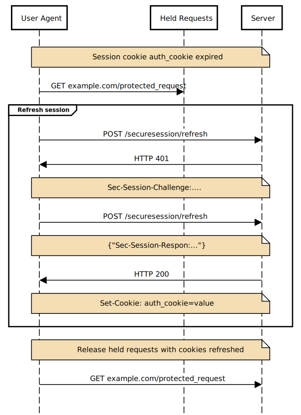

# Device Bound Session Credentials explainer

This is the repository for Device Bound Session Credentials. You're welcome to
[contribute](CONTRIBUTING.md)!

## Authors:
- [Kristian Monsen](kristianm@google.com), Google
- [Arnar Birgisson](arnarb@google.com), Google

## Participate (to come)
- [Issue tracker](https://github.com/WICG/dbsc/issues)
- [Discussion forum]

## Table of Contents
<!-- START doctoc generated TOC please keep comment here to allow auto update -->
<!-- DON'T EDIT THIS SECTION, INSTEAD RE-RUN doctoc TO UPDATE -->

- [Introduction](#introduction)
  - [Goals](#goals)
  - [Non-goals](#non-goals)
  - [What makes Device Bound Session Credentials different](#what-makes-device-bound-session-credentials-different)
    - [Application-level binding](#application-level-binding)
    - [Browser-initiated refreshes](#browser-initiated-refreshes)
  - [TPM considerations](#tpm-considerations)
  - [Privacy considerations](#privacy-considerations)
  - [Enterprise support](#enterprise-support)
- [High level overview](#high-level-overview)
  - [Start Session](#start-session)
    - [Session Registration Header](#session-registration-header)
    - [Session Registration JWT](#session-registration-jwt)
    - [Session Registration instructions JSON](#session-registration-instructions-json)
  - [Maintaining a session](#maintaining-a-session)
    - [Refresh procedure](#refresh-procedure)
    - [Ending a session](#ending-a-session)
- [Interactions with other APIs](#interactions-with-other-apis)
  - [Login Status API](#login-status-api)
  - [Interaction with Inactive Documents (BFCache, Prerendering)](#interaction-with-inactive-documents-bfcache-prerendering)
- [Alternative JavaScript API for StartSession](#alternative-javascript-api-for-startsession)

<!-- END doctoc generated TOC please keep comment here to allow auto update -->

## Introduction
Device Bound Session Credentials (DBSC) aims to reduce account hijacking caused by cookie theft. It does so by introducing a protocol and browser infrastructure to maintain and prove possession of a cryptographic key. The main challenge with cookies as an authentication mechanism is that they only lend themselves to bearer-token schemes. On desktop operating systems, application isolation is lacking and local malware can generally access anything that the browser itself can, and the browser must be able to access cookies. On the other hand, authentication with a private key allows for the use of system-level protection against key exfiltration.

DBSC offers an API for websites to control the lifetime of such keys, behind the abstraction of a session, and a protocol for periodically and automatically proving possession of those keys to the website's servers.  There is a separate key for each session, and it should not be possible to detect two different session keys are from one device. One of the key goals is to enable drop-in integration with common types of current auth infrastructure. By device-binding the private key and with appropriate intervals of the proofs, the browser can limit malware's ability to offload its abuse off of the user's device, significantly increasing the chance that either the browser or server can detect and mitigate cookie theft.

DBSC is bound to a device with cryptographic keys that cannot be exported from the user’s device under normal circumstances, this is called device binding in the rest of this document. DBSC provides an API that servers can use to create a session bound to a device, and this session can periodically be refreshed with an optional cryptographic proof the session is still bound to the original device. At sign-in, the API informs the browser that a session starts, which triggers the key creation. It then instructs the browser that any time a request is made while that session is active, the browser should ensure the presence of certain cookies. If these cookies are not present, DBSC will hold network requests while querying the configured endpoint for updated cookies.

### Goals
Reduce session theft by offering an alternative to long-lived cookie bearer tokens, that allows session authentication that is bound to the user's device. This makes the internet safer for users in that it is less likely their identity is abused, since malware is forced to act locally and thus becomes easier to detect and mitigate. At the same time the goal is to disrupt the cookie theft ecosystem and force it to adapt to new protections.

DBSC's primary threat model is that of an attacker who can read and tamper with the user agent, such as with a malware-compromised browser, in which the malware can read and modify browser memory and secrets stored on disk. In many operating systems, malware may be able to obtain privileged (root, kernel, etc.) access. DBSC aims to address this threat by establishing a cryptographic protocol in which secrets can be stored in dedicated systems (such as secure enclaves), though DBSC does not specify how implementors should store, backup, or sync keys as long as such storage is robust against the described threat. 

As a secondary consideration, DBSC also mitigates against certain types of network and server compromise, such as network Attackers-in-the-Middle (where an attacker can read or modify network traffic) or HTTP server log leaks (where a server mistakenly logs full HTTP request/response headers to logs which can be read by unprivileged insiders).

In all of these scenarios, DBSC aims to enforce the specific constraint that *temporary read/write access to a user agent or network traffic does not enable long-lived access to any established DBSC sessions*. For example, if an attacker has malware running within a victim browser process, they should be unable to continue to authenticate as the victim browser once that malware is removed. (Note, however, that the definition of "long-lived" depends upon the configured refresh period; within that period, attackers *may* continue to have short-lived access to any established sessions.)

### Non-goals
DBSC will not prevent temporary access to any browser sessions while the attacker has ongoing access to a compromised user-agent. An attacker with ongoing access to a compromised user agent (or network AitM, etc) will be able to continuously access fresh DBSC-controlled bearer tokens, and an attacker with malware running on a compromised device will, on many modern operating systems, be able to treat even secure elements as a signing oracle, in order to provide proof-of-possession of the DBSC secret keys.

### What makes Device Bound Session Credentials different
DBSC is not the first proposal towards these goals, with a notable one being [Token Binding](https://en.wikipedia.org/wiki/Token_Binding). This proposal offers two important features that we believe makes it easier to deploy than previous proposals. DBSC provides application-level binding and browser initiated refreshes that can make sure devices are still bound to the original device.

#### Application-level binding
For websites, device binding is most useful for securing authenticated sessions of users. DBSC allows websites to closely couple the setup of bound sessions with user sign-in mechanisms, makes session and key lifetimes explicit and controllable, and allows servers to design infrastructure that places verification of session credentials close to where user credentials (cookies) are processed in their infrastructure.

Alternatives such as Token Binding gain much from e.g. integrating with TLS, but this can make integration harder in environments where e.g. TLS channel termination is far removed from the application logic behind user sign-in and session management.

#### Browser-initiated refreshes
Other proposals have explored lower-level APIs for websites to create and use protected private keys, e.g. via WebCrypto or APIs similar to WebAuthn. While this works in theory, it puts a very large burden on the website to integrate with. In particular, since the cost of using protected keys is high, websites must design some infrastructure for collecting signatures only as often as needed.

This means either high-touch integrations where the keys are only used to protect sensitive operations (like making a purchase), or a general ability to divert arbitrary requests to some endpoint that collects and verifies a signature and then retries the original request. The former doesn't protect the whole session and violates the principle of secure by default, while the latter can be prohibitively expensive for large websites built from multiple components by multiple teams, and may require non-trivial rewrites of web and RPC frameworks.

DBSC instead allows a website to consolidate the session binding to a few points: At sign-in, it informs the browser that a session starts, which triggers the key creation. It then instructs the browser that any time a request is made while that session is active, the browser should ensure the presence of certain cookies. The browser does this by calling a dedicated refresh endpoint (specified by the website) whenever such cookies are needed, presenting that endpoint with a proof of possession of the private key. That endpoint in turn, using existing standard Set-Cookie headers, provides the browser with short-term cookies needed to make other requests.

This provides two important benefits:
1. Session binding logic is consolidated in the sign-in mechanism, and the new dedicated refresh endpoint. All other parts of the website continue to see cookies as their only authentication credentials, the only difference is that those cookies are short-lived. This allows deployment on complex existing setups, often with no changes to non-auth related endpoints.
1. If a browser is about to make a request where it has been instructed to include such a cookie, but doesn't have one, it defers making that request until the refresh is done. While this may add latency to such cases, it also means non-auth endpoints do not need to tolerate unauthenticated requests or respond with any kind of retry logic or redirects. This again allows deployment with minimal changes to existing endpoints.

Note that the latency introduced by deferring of requests can be mitigated by the browser in other ways, which we discuss later.

### TPM considerations
DBSC depends on user devices having a way of signing challenges while protecting private keys from exfiltration by malware. This usually means the browser needs to have access to a Trusted Platform Module (TPM) on the device, which is not always available. TPMs also have a reputation for having high latency and not being dependable. Having a TPM is a requirement for installing Windows 11, and can be available on previous versions. All our studies are for public key cryptography using ECDSA_P256 algorithm.

 Chrome has done studies to understand TPM availability to understand the feasibility of secure sessions. Current data shows about 60%, and currently growing, of Windows users would be offered protections. Studies have also been done on the current populations of TPMs, both for latency and for predictability. Currently the latency is (P50: 200ms/ P95: 600ms) for signing operations. The error rate is very low, currently around 0.001%.

Based on this research, TPMs are widely available, with a latency and consistency that is acceptable for the proposed usage.

### Privacy considerations
An important high-level goal of this protocol is to introduce no additional surface for user tracking: implementing this API (for a browser) or enabling it (for a website) should not entail any significant user privacy tradeoffs.

There are a few obvious considerations to ensure we achieve that goal:
- Lifetime of a session/key material: This should provide no additional client data storage (i.e., a pseudo-cookie). As such, we require that browsers MUST clear sessions and keys when clearing other site data (like cookies).
- Cross-site/cross-origin data leakage: It should be impossible for a site to use this API to circumvent the same origin policy, 3P cookie policies, etc. (More on this below.)
- Implementing this API should not meaningfully increase the entropy of heuristic device fingerprinting signals. (For example, it should not leak any stable TPM-based device identifier.)
- This API—which allows background "pings" to the refresh endpoint when the user is not directly active—must not enable long-term tracking of a user when they have navigated away from the connected site.
- Each session has a separate new key created, and it should not be possible to detect that different sessions are from the same device.

### Enterprise support

While DBSC addresses a general problem of session hijacking, and can be applicable to any _browser_ consumer, it is possible to expand this protocol to better support enterprise use cases. By adding specifics to key generation, we can provide a more secure environment for enterprise users. This is the goal of DBSC(E), which is an extension to DBSC. The high-level design of DBSC(E) is described in the [DBSC(E) Overview](./DBSCE/Overview.md).

DBSC(E) removes the vulnerability DBSC has, where a malware, if already present in the device during the key generation, can potentially take over the session. DBSC(E) proposes to mitigate this vulnerability by introducing device key chaining: More details about the importance of DBSC are here: [Why DBSC(E)?](./DBSCE/Overview.md/#why-dbsce)

## High level overview

[Link to editable diagram](https://sequencediagram.org/index.html#initialData=A4QwTgLglgxloDsIAIBEAVACgWVckAzshAFCiSzwhJoBCYA9gO4ECmYehyARmeNHEQpUAZXYA3dpyJMScktwC0APiYAuZASgBzBIqgJkAMwA2zEkxXcNAJgAMd5EwD0W3awAm+wzAZJWSAA0yGCsBMB+bMgGMCYArh5hyAAWrCCJYMQMmhD8mqwwcaH5BFp+AHTIyAA6CAASaRkaqKIFimKlUH6KAEqs2lAEEGAg0H4a5ZPIMMkgJiYB2qwAvJPlLbUAFDNzCwhLIawAjnFQoR7GDJnAYFDio6zIANasAJ7INwwMRsjfHwylMJlBAAShICAYEEeDEkmWsPEYLHY0QQUGgDyIbE6fh4Bg8Bm0tW4hE8v0MqXSyJuYQCMFYChUEA0oROYRQMFCD2eb1AZxIECszNYECKhmAcW4Jlg3Ne4Mh0NhPA0HLSUOQACkAOroJzOHbzRb0pTKJksuJszQ6Qxa9D8wWHEVga3ay26UZFI0qdTITAAeREOtcBQ9WOBrlykFDXUMtVqLQA3qg5tpUGo1sFUBBXsBU6gbahgmsAL7x9OoF6vXMAHnFktgAH0K8pUEWWsg5WqYcjvUMro9a1KYDLgmyQHWCMkSsCLPb7I4XL4GE8oI9qBcoziAJIAESJDA87xi8USmN8wGhP0Xy6SmyuOgMyAA1B9RskQbGEBSmmhWgKAMJfNeGggHEEDJPWV4rhsCDcPurzNKgiYbgg9ZQIkSBQEYK4cGmkytqgJDLMsIgMAAto80DkS+gIEGsREdgqyLwnEbCZLEsBPEQUoIE8lzXK+yCuGRBR+FCSAMso8IzAUvGYb8twDAgj6gGBhwnGcSSwXECAXJB9JzCgWk6dMgErsgEIoGaGkeBJ3oAOIAKKBgQwm+P44mWJJtgOLqbliaQrAmFERm6aZjxWecElSakMCyT8EWknpRCsAAHoMpAGWppznCZS5mdSbA0Gu5mQsgqXANZtkaI5zmuaJASkJ58Jzr59XiYFUQJaFeWPKRgxaPs8llSlFWRRZjFwkKrJDMgiRGOwOVMMkUALE4jxLOyYW0ZMVU+v6znBqEyHOKERhHZOtRfuwCFiDA7RAtGiibh4GgANrIcgO4ALotDOXkACx2AAjB+DSUmAN1tB0wKKH+swGvsrAaMhqHodAWHsKskzBPqexLFj6wEeNvyKlJnJqjavnw3jnommoZoWm4zq2gKXkOqKGoukz7qhLtfoBoJbCFEdD1+CdrBnWEF2fo010-rd93YnofThJESPIK9No-UT8ok92Gj3FKHhcp8fx-BENHRn91gtQuYX4MZH07nuB4orECRJAQZ4Xrl15ELeCkPs+Klvh+V0Q-Lwqw2FwGgeBenQbBB4IUhosoWhDWYdhqbFr9xNdpN+TC48H2juOqQeMER1xORtR3opcxZWyu01YLdXuY1s4+S4LlUX5DUkAENlD0AA))  
The general flow of a secure session is as follows:
1. The website requests that the browser start a new session, providing an HTTP endpoint to negotiate registration parameters.
1. The browser creates a device-bound key pair, and calls the registration HTTP endpoint to set up the session and register the public key.
1. The server responds with a session identifier, and instructions on how to maintain the session. This is a (possibly empty) list of cookie names that the browser is expected to ensure exist, and their associated scope (origins+path).
1. At a later time the session is closed by either the server requesting to close the session or the user clears the keys by clearing site data.

As long as that session is active, the browser performs the following refresh as needed:
1. For any request within an applicable scope, the browser checks if the necessary cookies exist. If they exist, continue as normal.
1. If not, the browser defers such requests while performing the following.
1. The browser contacts the HTTP endpoint for the session, providing the session identifier and, if requested by the server, the necessary proof of possession of the associated private key. 
1. If the server is satisfied with the proof, it uses regular Set-Cookie headers to establish the necessary cookies with an appropriate Max-Age. The response can also include an updated set of instructions, e.g. if the server wishes to change which cookies are subject to this logic.
1. If any requests were deferred in step 2, the browser now makes those requests including the updated set of cookies.
1. The browser may choose to proactively refresh cookies that are about to expire, if it predicts the user may soon need them. This is purely a latency optimization, and not required.

There is an option for the server to opt out of the browser defering requests. If so it will instead:
1. Sign any requests that would be defered, use the most recent challange. If there is not one, use the current timestamp. The browser may cache these signatures.
1. The server can respond with 401 if it wants the request signed with a new challenge.
1. The server can also serve challenges ahead of time on any response with the Sec-Session-Challenge header.
1. Once the browser get an instruction to set the missing cookie it will stop signing requests.
We do not reccomend this option for most deployments, but it is possibly for those that want to potentially save a network roundtrip in some circumstances.


### Start Session


[Link to editable diagram](https://sequencediagram.org/index.html#initialData=MoUwTgbuC0B8CqBncACAggcxAOwC4C4VQBjaURRASwHttoAlEDSxXMAQ1xuwCgeMw1AK4AHFMlyjxICtxRgQARyEzcPJKkw5ccUJHD4ACgHlgAFRQB6ZMSELks2tdzswuB1Vo9s1XCBTUUGAoGsFaeAA0ekEAxADuABYgnPgA3gBEAEaU2AAmORjQ7AA2GPgAdJXpAL7qyGFYeAA8ZOBB+KA6AMLU1ADWlCCE7EK4CQD6xL0DIN6+-oGooeiNuFFt4PFJKRke3NCUudqUAGaDYBVVtTi5fD5+AUEh9SvaW8kE5J7YKCwoPnEUOxiFwoDwgA)

#### Session Registration Header
The session start process is initiated by the server attaching a header with Sec-Session-Registration and appropriate parameters, this looks like:
```http
HTTP/1.1 200 OK
Sec-Session-Registration: (RS256 ES256);challenge="challenge_value";path="StartSession"
```
This is a structured header with a list of token arguments representing the allowed algorithms (possibilities are ES256 and RS256). The list have multiple string attributes, "path" is required describing the endpoint to use, "challenge" is to provide a challenge value for the registration JWT. There is also an optional string attribute called authorization. There can be more than one registration on one response:
```http
HTTP/1.1 200 OK
Sec-Session-Registration: (ES256 RS256);path="path1";challenge="challenge_value";authorization="authcode"
Sec-Session-Registration: (ES256);path="path2";challenge="challenge_value"
```

An equivalent way of writing this is:
```http
HTTP/1.1 200 OK
Sec-Session-Registration: (ES256 RS256);path="path1";challenge="challenge_value";authorization="authcode", (ES256);path="path2";challenge="challenge_value"
```

The authorization value is optional for servers to send, but mandatory for clients to implement. If present, it will be sent to the registration endpoint in the `Authorization` header, and included in the registration JWT. This allows passing a bearer token that allows the server to link registration with some preceding sign in flow, as an alternative to the more traditional use of cookies. While this can also facilitate integration with some existing infrastructure, e.g. ones based on OAuth 2.0, this parameter is general and is not limited to the similarly named [Authorization Code](https://datatracker.ietf.org/doc/html/rfc6749#section-1.3.1) in OAuth 2.0.

#### Session Registration JWT
The browser responds to the session start by selecting a compatible signature algorithm and creating a device-bound private key for the new session. It then makes the following HTTP request (assuming the endpoint URL is https://auth.example.com/securesession):

```http
POST /securesession/startsession HTTP/1.1
Host: auth.example.com
Accept: application/json
Cookie: whatever_cookies_apply_to_this_request=value;
Sec-Session-Response: JWT Proof

```
The JWT proof is signed with the newly created private key, and needs to contain the following values (the public key is in the [JWK](https://datatracker.ietf.org/doc/html/rfc7517) format):
```jsonc
// Header
{
  "alg": "Signature Algorithm",
  "typ": "JWT",
}
// Payload
{
  "aud": "URL of this request",
  "jti": "challenge_value",
  "iat": "timestamp",
  "key": {
    "kty": "key type",
    "<kty-specific parameters>": "<value>",
  },
  "authorization": "<authorization_value>", // optional, only if set in registration header
}
```

#### Session Registration instructions JSON
If the request is properly authorized, the server establishes whatever state represents the session server-side, and returns the following response.

```http
HTTP/1.1 200 OK
Content-Type: application/json
Cache-Control: no-store
Set-Cookie: auth_cookie=abcdef0123; Domain=example.com; Max-Age=600; Secure; HttpOnly;
```

```jsonc
{
  "session_identifier": "session_id",
  "refresh_url": "/RefreshEndpoint",

  "scope": {
    // Origin-scoped by default (i.e. https://example.com)
    // Specifies to include https://*.example.com except excluded subdomains.
    // This can only be true if the origin's host is the root eTLD+1.
    "origin": "example.com",
    "include_site": true,
    "defer_requests": true, // optional and true by default

    "scope_specification" : [
      { "type": "include", "domain": "trusted.example.com", "path": "/only_trusted_path" },
      { "type": "exclude", "domain": "untrusted.example.com", "path": "/" },
      { "type": "exclude", "domain": "*.example.com", "path": "/static" }
    ]
  },

  "credentials": [{
    "type": "cookie",
    // This specifies the exact cookie that this config applies to. Attributes
    // match the cookie attributes in RFC 6265bis and are parsed similarly to
    // a normal Set-Cookie line, using the same default values.
    // These SHOULD be equivalent to the Set-Cookie line accompanying this 
    // response.
    "name": "auth_cookie",
    "attributes": "Domain=example.com; Path=/; Secure; SameSite=None"
    // Attributes Max-Age, Expires and HttpOnly are ignored
  }]
}
```

If the request is not properly authorized, the server can request a new signed request by answering instead with a 401:

```http
HTTP/1.1 401
Sec-Session-Challenge: "challenge_value"
```

Where Sec-Session-Challenge header is a structured header with a list of challenge values that may specify an optional "id" parameter: "challenge_value";id="session_id".
The challenge applies to the current context if "id" is not present; otherwise it applies to the specific session. The browser ignores the challenge if "id" doesn't match any session locally.

Subsequently, as long as the browser considers this session "active", it follows the steps above, namely by refreshing the auth_cookie whenever needed, as covered in the next section.

Note if multiple cookies are required, the server returns multiple Set-Cookie headers, with corresponding entries in the "credentials" array in the response body.  

### Maintaining a session
As long as the named cookie is not expired the browser will keep sending requests as normal. Once the cookie is expired the browser will hold all requests for the scope of the cookie, except where the server excluded the paths in the registration, while refreshing the cookie. This is where the browser driven protocol makes a difference, if not for this there would be potentially many requests without the required cookie.
#### Refresh procedure


[Link to editable diagram](https://sequencediagram.org/index.html#initialData=A4QwTgLglgxloDsIAICqBnApmZBBA5pkgFCiSzwhLIASmANgCbIBKmAjgK6boTqnhocRCgDK2AG7ZixBAHsImZHKk4M2PISQAacWFUBiAO4ALTCAgAucenRQ5CZDDlyA1lCUhOEEwH1nbh7ImAAewFBgmIzE6jgERBAAtAB8dEysHNy86JbIAOIAogAqwSEgALbA9JgAdM7lAPTAYAqYMIqMvpFcPBDE+C2cwBkAZpHoJshYtvYIMVhxWknJeqqWAAoA8qIlDVgwnOM8dg4NkWM8JsSr2CmxmgmWNEVF68gALAAMAIyyrcqqNALB46G5gYxmCzWNqJGwnBCJADCJhA9GqCEIlhq2Jq8w08SQKTBG22u32hx4x1mZ0wFwmf0UAI09wJEF0kmwEPMVgA3gAicQwWFUhyJNjoYAOLHYvkAX2uHLAd2BrKeLzeACZPp8GUoVMyVUt2fpOaZudCkoiXO5MLkvD5-NaPABeCSo7jEIjReSM-VqQ0JY2GM1QtjVEBYZBmdLdLJ8ZBGKA+JxOnjIc7jMzRFlLImK3KFEqhCpVWr1JotRTtKJdTK9YhAA)

The browser refreshes the short-term session credential by calling the session endpoint:

```http
POST /securesession/refresh HTTP/1.1
Host: auth.example.com
Accept: application/json
Cookie: whatever_cookies_apply_to_this_request=value;
Sec-Session-Id: session_id
```

In response to this the server can optionally first request a proof of possession of the key by issuing a challenge to the browser by responding with a 401 response with a challenge:

```http
HTTP/1.1 401
Sec-Session-Challenge: "challenge_value";id="session_id"
```

The server can also serve challenges ahead of time attached to any response as an optimization, for example:
```http
HTTP/1.1 XXX
Sec-Session-Challenge: "challenge_value";id="session_id"
```

It is also possible to send challenges to multiple sessions:
```http
HTTP/1.1 XXX
Sec-Session-Challenge: "challenge 1";id="session 1"
Sec-Session-Challenge: "challenge 2";id="session 2"
```

This can also be formatted as:
```http
HTTP/1.1 XXX
Sec-Session-Challenge: "challenge 1";id="session 1", "challenge 2";id="session 2"
```
as each challenge is a structured header item.

The browser replies to that response with a Sec-Session-Response header, containing a signed JWT:

```http
POST /securesession/refresh HTTP/1.1
Sec-Session-Response: JWT proof
```

The JWT proof contains:
```json
{
  "jti": "challenge_value",
  "aud": "the URL to which the Sec-Session-Response will be sent",
  "sub": "the session ID corresponding to the binding key",
}
```

If the server is satisfied with the response, or if it did not request it, it answers by setting the short term cookie. Optionally the server can adjust the session in the body of the response (similar to how it was set up)[https://github.com/WICG/dbsc/blob/main/README.md#session-registration-instructions-json].

```http
HTTP/1.1 200 OK
Content-Type: application/json
Cache-Control: no-store
Set-Cookie: auth_cookie=abcdef0123; Domain=example.com; Max-Age=600; Secure; HttpOnly;
```
The contents is a json with the same specifications as during the registration.
On receiving this response, the browser releases any requests that were deferred pending this refresh, including the new cookie.
Note:
This response is identical to the response to session setup, and can be handled by the same logic in the client.
The new set of instructions replaces any previous instructions for the session. E.g. if the cookie name is different here than before, the browser should not trigger refreshes based on the absence of the old cookie name.
The server may issue a different Max-Age, or scope for the short-term cookie.
The server may set or update other cookies not subject to session refreshes in this response, as in any response.

If instead the server decides to end the session it can respond with:
```json
{
  "session_identifier": "session_id",
  "continue": false
 }
```
In this case the browser should stop triggering any refreshes for this request, release any deferred requests without the short-term cookie, and clean up and delete the associated session state including the binding key.

#### Ending a session
The session can end in several ways:
- The server can end the session during a refresh by answering with {“continue”: false} during a refresh
- The server can at any time send a header with Clear-Site-Data: "storage"
- The user can clear site data, which will locally clear cookies and any registered session keys for the site

It is important that the user is always in control and can delete the session keys if wanted.

## Interactions with other APIs
### Login Status API
### Interaction with Inactive Documents (BFCache, Prerendering)
When a session is ended for any reason, any inactive documents which had access to that session's credentials should be destroyed. This ensures that pages in BFCache or that are pre-rendering that contain information guarded by those credentials are not presented after the session has ended.

## Future possibility: JavaScript API for StartSession

The JavaScript API is not currently implemented, and not planned to be part of the iniital DBSC launch. The text below describes one possible future shape for that API.


[Link to editable diagram](https://sequencediagram.org/index.html#initialData=A4QwTgLglgxloDsIAIDqBTARsgCiA5ugFCiSzwhLICqAzumMgIKFInjRyIoDKDAbgyJF8YAPYBXYMh4QOyerVpQxCIhmx5CAWgB8dBs1YQAXMgQh+UfCAhiwAOnowJYdIuWqncyAAoHAQCURAhiEOjIYoKMBows6EgAxADuABbotiYAwm62EQDW6ACeyKBQYESxRgkQenxg0SY4API8ACrIAPTOru7ungjdPhAhYRFRhlXxSAA09dEp6ZkA3gBEmFAIACab+NogADb4JgEOqwC+RPMMelPGJgASbW04yABMAAwfo+GR0TT0OLGOYCBiLDKmPi1LJiMT5KDoMwgCQQVIAfRgsPh6AAvPxDhJiBpcAR0AAebR3GpmYDiAC2UHoDjctDEB0E-iCRASWx+43+xK06BBDTBaQhJj4ShUCGQjPMYmSyBAMGggiIQA)

The API could consist of a new interface, SecureSession, an instance of which is obtained via the securesession property of the navigator object. The SecureSession interface would ideally support the following method:

- **startSession():**
- Parameters:
  - endpoint: The URL of the secure session endpoint, supporting /startsession and /refresh operations
  - supported_binding_algs: Array of cryptographic algorithms supported by the server
  - authorization: Optional authorization value to be passed to Start Session HTTP request
- Returns:
  - A promise with a string containing the session ID (which may be empty)

When called, this method must:
- Generate and store a new, secure cryptographic key pair
- Call the "endpoint" + /startsession as specified below in Start Session (HTTP Request/Response)
- Return a promise which
  - If that call succeeds (i.e. returns an HTTP 200), returns a session ID obtained from that call (which can be the empty string)
  - If that call fails, throws an exception (which may indicate the HTTP status of the failed call)

Requirements:
- The endpoint must have the same origin as the JavaScript.

Below is an example of the theoretical API being used:
```javascript
let promise = navigator.secureSession.start({
  // Session start options
  "endpoint": "<url prefix of standard session endpoint>", // required
  "supportedBindingAlgorithms": ["ES256,RS256"], // required
  "authorization": "<authorization value>", // optional
});
promise.then((sessionInfo) => {
  // Success means the browser has completed the session setup with the
  // session endpoint and will perform the necessary maintenance tasks
  // going forward.
  console.log("Session with id {} was started.", sessionInfo.id);
});
promise.catch((...) => {
  // Session start failed for some reason, e.g. the HTTP endpoint was
  // not reachable, or broke protocol.
  <error handling>
});
```
